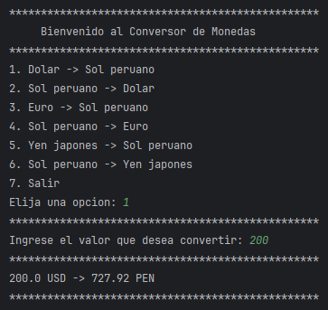

# Reto-ONE-Conversor-Monedas

Este proyecto es una aplicación de consola en Java que permite **convertir montos entre diferentes monedas** usando una **API** externa para obtener las tasas de cambio actualizadas.

---

## Funcionalidades

- Conversión entre:
    - Dólar Estadounidense (USD) y Sol Peruano (PEN)
    - Euro (EUR) y Sol Peruano (PEN)
    - Yen Japonés (JPY) y Sol Peruano (PEN)
- Interfaz de consola simple para elegir la moneda base y destino.
- Consulta dinámica de tasas de cambio mediante la clase `ApiClient`.

---

